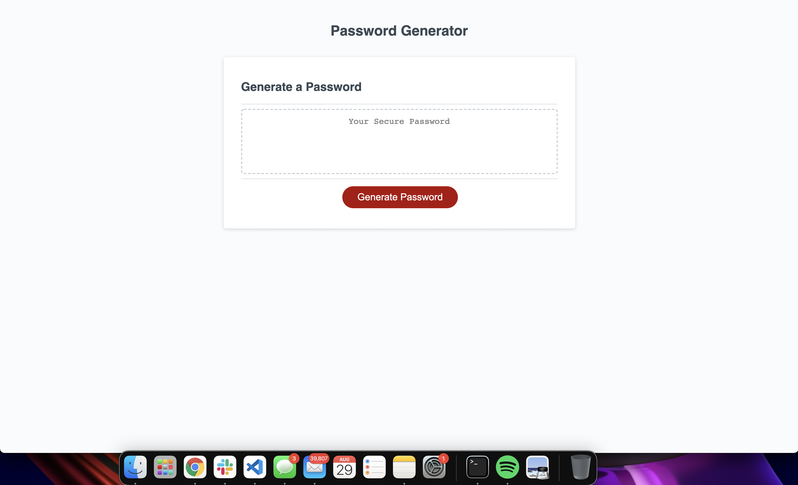

# Challenge 3 - Password Generator

For this challenge the developer was asked to create a random password generator that required an at least 8 characters no more than 128. Users are to be prompted with multiple options to refine their password strength through varied degrees of complexities. Once presented with the array of options the generator would produce and unique random password.

###Link:
https://urbanearthymama.github.io/challenge-3/

